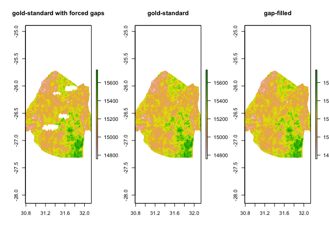
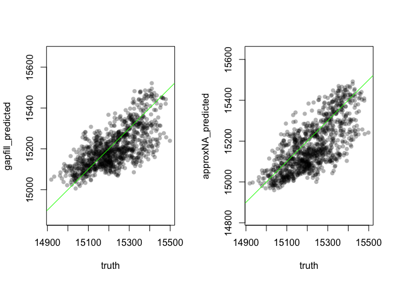

Gapfilling algorithm
================

Gapfilling raster data
----------------------

Often remotely sensed data have gaps across space and time, due to things like cloud. This algorithm uses a randomforest to fit a model using latitude, longitude, time, and elevation to fill in the gaps. Additionally, a linear interpolation across missing values in time is used as a covariate. The `gapfill.R` script contains the function `gapfill`. See `gapfill_example.R` for an example of using the function on LST data from Swaziland with artificially imposed gaps. Some outputs of that example script are shown below.


``` r
# Run algorithm on LST data for Swaziland with artificially created gaps (LST)
LST_gapfilled <- gapfill(LST, elevation, data_points = 40000)

# Plot results for 1 time slice
par(mfrow=c(1,3))
plot(mask(LST[[2]], swz_adm0), main = "gold-standard with forced gaps")
plot(mask(LST_gold_standard [[2]], swz_adm0), main = "gold-standard")
plot(mask(LST_gapfilled[[2]], swz_adm0), main = "gap-filled")# gap-filled comparison
```

<!-- -->

Look at observed versus predicted across all time slices
<!-- -->

    ## [1] "Mean squared error 5440.4"

Compare to results using interpolation across layers using the
`approxNA` function
<!-- -->

    ## [1] "Mean squared error 10556.7"

